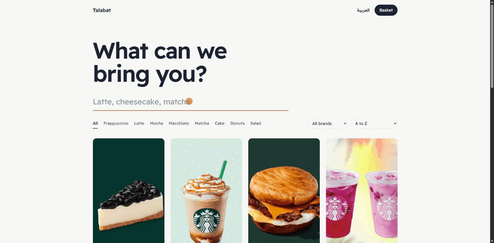

# Talabat API

[](https://github.com/AhmeddAymannHalim/LinkDev.Talabat/actions/workflows/ci.yml)

An e-commerce REST API for a café delivery service, built with **ASP.NET Core 8** and **Clean Architecture**, with a lightweight bilingual (English / Arabic, RTL) storefront.



## About this version

The project started as a course project (LinkDev ASP.NET Core track). This version is an upgrade of it, applying what I learned from more than a year of professional ASP.NET Core work: security hygiene, correctness, automated tests and CI. See [What changed](#what-changed-in-this-version).

## Try it

- **Run it locally** in a few minutes: see [Getting started](#getting-started). Then open `/store/` for the storefront and `/swagger` for interactive API docs.
- **Call the API from Postman:** import the ready-made collection from [`docs/postman`](docs/postman). See [API documentation](#api-documentation).
- **Host your own public demo:** see [`docs/DEPLOY.md`](docs/DEPLOY.md).

## Features

- **Clean Architecture**: Domain, Application, Infrastructure and API layers with one-way dependencies.
- **Catalog**: brands, categories, search, sorting and pagination, built on the Specification pattern.
- **Basket**: stored in **Redis** with a configurable time-to-live. Guests can shop anonymously.
- **Orders**: create and view orders, with delivery methods. Totals are always computed from database prices, never from client input.
- **Authentication**: ASP.NET Core Identity with **JWT** bearer tokens, role claims and saved addresses.
- **Persistence**: EF Core with SQL Server, Generic Repository + Unit of Work, and an audit interceptor (created / modified tracking).
- **Cross-cutting**: global exception middleware with a uniform error response, structured validation errors, Swagger UI, automatic migration and seeding at startup.
- **Storefront**: plain HTML/CSS/JS in `LinkDev.Talabat.APIs/wwwroot/store`, served by the API at `/store/`. Live search, filters, sorting, a basket drawer, English and Arabic with RTL.

## Architecture

```
APIs ----------> APIs.Controllers
  |                   |
  v                   v
Core.Application ---> Core.Application.Abstraction (DTOs, service contracts)
  |
  v
Core.Domain (entities, specifications, repository contracts)
  ^
  |
Infrastructure.Presistence (EF Core, repositories, seeding)    Infrastructure (Redis basket)
```

| Project | Responsibility |
|---|---|
| `LinkDev.Talabat.Core.Domain` | Entities, specifications and repository contracts |
| `LinkDev.Talabat.Core.Application.Abstraction` | DTOs and service interfaces |
| `LinkDev.Talabat.Core.Application` | Business logic, mapping and exceptions |
| `LinkDev.Talabat.Infrastructure.Presistence` | DbContexts, migrations, repositories and seeding |
| `LinkDev.Talabat.Infrastructure` | Redis basket repository |
| `LinkDev.Talabat.APIs.Controllers` | API controllers |
| `LinkDev.Talabat.APIs` | Startup project: Program, middleware, DI and the storefront |
| `LinkDev.Talabat.Tests` | Unit and integration tests |

## Getting started

### Prerequisites
- .NET 8 SDK
- SQL Server (Express is fine)
- Redis (the quickest way is Docker)

### 1. Databases
Connection strings are in `LinkDev.Talabat.APIs/appsettings.json` and default to a local SQL Server Express instance (`.\SQLEXPRESS`). Change `Server=` if yours is different. Two databases are used, `Talabat.APIs` and `Talabat.APIs.Identity`. They are created, migrated and seeded automatically on first run.

### 2. Redis
```bash
docker run -d --name talabat-redis -p 6379:6379 redis:7-alpine
```
The default connection string expects `localhost`.

### 3. Secrets
No secrets are stored in the repository. Set the JWT signing key with user-secrets:

```bash
cd LinkDev.Talabat.APIs
dotnet user-secrets set "JwtSettings:Key" "<a random secret of 64+ characters>"
```

Optional: seed a demo user by also setting a password. Without it, no user is created and you can register through the API.

```bash
dotnet user-secrets set "Seed:DemoUserPassword" "<password>"
```

### 4. Run
```bash
dotnet run --project LinkDev.Talabat.APIs
```
- Swagger UI: `/swagger` (Development, or set `Swagger:Enabled=true`)
- Storefront: `/store/`

### 5. Tests
```bash
dotnet test LinkDev.Talabat.Tests
```
- **Unit tests** use xUnit and Moq and need nothing external.
- **Integration tests** boot the real API against throw-away SQL Server databases and a real Redis. They read `TALABAT_TEST_SQL` (SQL Server connection string without a database) and `TALABAT_TEST_REDIS` (`host:port`), defaulting to local SQL Server Express and `localhost:6379`. If a server isn't reachable they are skipped, not failed. CI runs both with service containers.

## API documentation

There are two ways to explore the API, and both are always in sync with the code:

**Swagger UI** at `/swagger` lists every endpoint and lets you call it from the browser. Click *Authorize* and paste a token from `POST /api/account/login` to call protected endpoints.

**Postman collection** in [`docs/postman`](docs/postman): 26 requests in the order a customer uses them (account, catalog, basket, orders), with 42 assertions.

1. In Postman choose *Import* and select both files in `docs/postman`.
2. Select the **Talabat - Local** environment and set `baseUrl` to where your API runs (for example `http://localhost:5086`).
3. Open the collection and press *Run*. Register and Login save the token automatically, and later requests reuse the product, basket and order ids.

The same collection runs from the command line:

```bash
npx newman run docs/postman/Talabat.postman_collection.json \
  -e docs/postman/Talabat-Local.postman_environment.json \
  --env-var baseUrl=http://localhost:5086
```

### Main endpoints

| Area | Endpoint |
|---|---|
| Account | `POST /api/account/login`, `POST /api/account/register`, `GET /api/account`, `GET/PUT /api/account/address`, `GET /api/account/emailexists` |
| Products | `GET /api/products` (`search`, `sort`, `brandId`, `categoryId`, `pageIndex`, `pageSize`), `GET /api/products/{id}`, `GET /api/products/brands`, `GET /api/products/categories` |
| Basket | `GET/POST/DELETE /api/basket` |
| Orders (auth) | `POST/GET /api/orders`, `GET /api/orders/{id}`, `GET /api/orders/deliveryMethods` |

## What changed in this version

**Security**
- The JWT signing key moved out of source control into user-secrets, and the app now fails fast with a clear message if it is missing.
- Removed the hard-coded seed user and password. A demo user is only created when a password is supplied through configuration.
- Upgraded AutoMapper to a release that fixes a known high-severity advisory, and aligned mixed IdentityModel package versions.

**Correctness (found by tests and by running the real API)**
- Product search never matched most products because `NormalizedName` was never populated by the seeder.
- Orders could be created from an empty basket, with an unknown delivery method, or with a product that no longer exists. Each now returns a proper 400 or 404.
- Looking up a missing basket never reported "not found" (wrong variable in the null check).
- A missing employee was mapped instead of returning 404.
- `pageSize=0` or a negative `pageIndex` are now clamped to valid values.
- Unhandled exceptions are now always logged (production logging was an empty branch).
- Seeding no longer depends on the working directory, and no longer breaks on case-sensitive file systems.

**Quality**
- Unit tests for the basket, order, product, employee and auth services, plus end-to-end integration tests against real SQL Server and Redis.
- GitHub Actions workflow that builds and runs every test with SQL Server and Redis service containers.
- Test-only controller endpoints (`BuggyController`) are compiled in Debug builds only.

**Product and documentation**
- A bilingual storefront with RTL support, served by the API.
- A tested Postman collection, a hosting guide and an optional Swagger switch for hosted demos.

## Roadmap
- Connect the storefront basket and checkout to the API (needs a sign-in screen).
- Payment integration.
- Admin area for managing products and orders (needs admin-only endpoints first).

## License and disclaimer

The source code is released under the [MIT License](LICENSE).

This is a personal portfolio project. It is not affiliated with, endorsed by, or connected to Talabat or any of the brands that appear in the sample data. Product names, brand names and the sample product photos in `LinkDev.Talabat.APIs/wwwroot/images` belong to their respective owners and are used here only to demonstrate the application. They are not covered by the MIT License.
